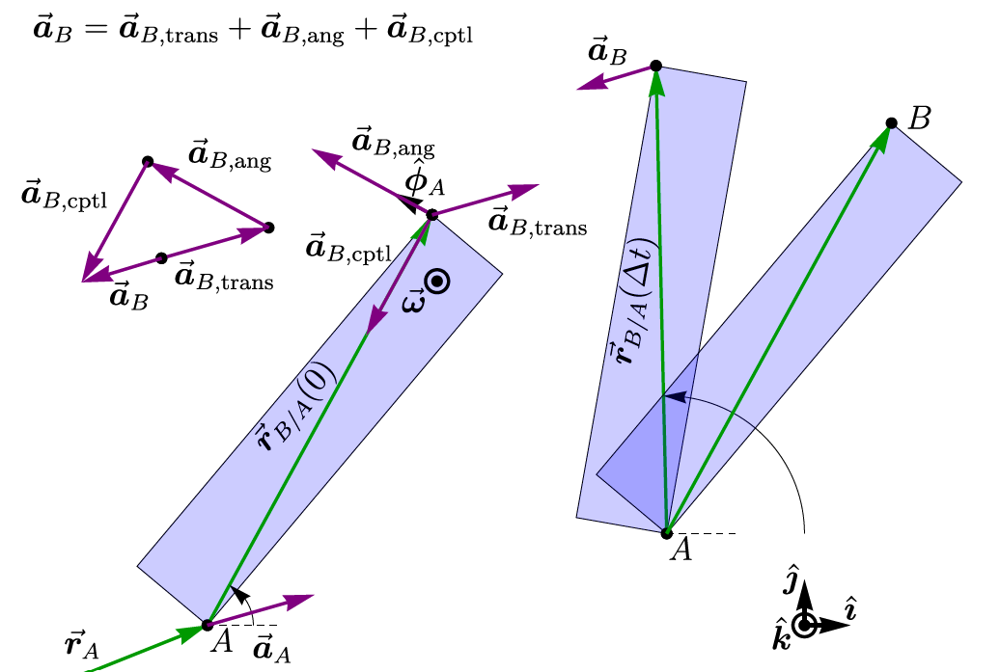

+++ { "kind": "split-image" }

## Werkcollege ##: Starre lichamen

Dynamica WB1135

{button}`Check our latest book publication <https://tudelft.nl>`  

Author: Thomas Keesom
Materiaal: Peter Steeneken



+++

Als toepassing van het vak Implementatie van Onderwijs voor de verdiepende lerarenopleiding aan de TU Delft, is deze test werkcollege opgesteld voor het eerstejaars mechanica vak Dynamica WB1135. Deze opzet representeert mijn toekomstige visie voor online tekstboeken van mechanica vakken aan de TU Delft.

+++ {"kind": "justified"}
## Quick navigation
````{grid} 2
```{card}
:header: 📖 TUD publishing manual

Go to the manual of this starterkit
```
```{card}
:header: 📈 Results

jump to the results
```
```{card}
:header: 📯 Conclusion

jump to conclusions
```
```{card}
:header: 📙 Jupyter book
:url: https://jupyterbook.org/

Learn more about Jupyter book
```
````
