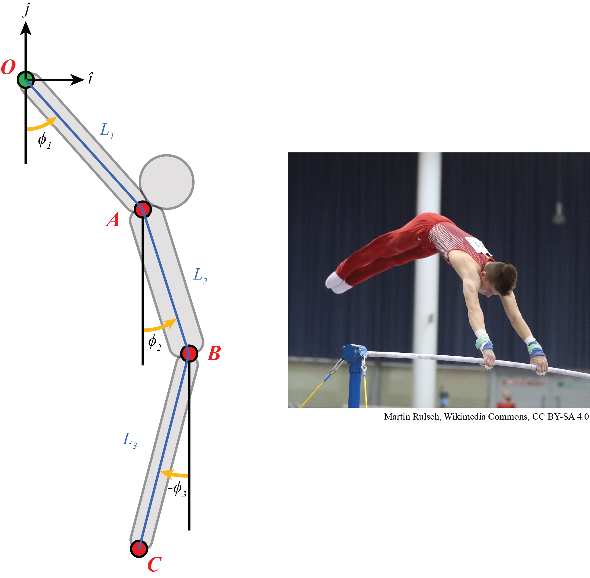

## Opgaven: Turner

Een turner aan het hoogrek zoals afgebeeld aan de rechterkant van het Figuur wordt versimpeld tot een systeem van vier starre lichamen. De armen, bovenlichaam en benen worden teruggebracht tot drie staven met lengtes $L_1$, $L_2$ en $L_3$ respectievelijk. De handen hebben de rekstok vast in punt $O$. 

1. Geef de positievector $\vec{r}_A$ als functie van $L_1$ en $\phi_1$. Gebruik het $\hat{i}, \hat{j}, \hat{k}$ co\"ordinatensysteem zoals afgebeeld in het Figuur.
1. Doe hetzelfde voor de positievectoren $\vec{r}_B$ en $\vec{r}_C$. Gebruik weer het $\hat{i}, \hat{j}, \hat{k}$ co\"ordinatensysteem zoals afgebeeld in Figuur \ref{fig:prob81}. 
1. Geef een uitdrukking voor de snelheidsvectoren $\vec{v}_A$, $\vec{v}_B$ en $\vec{v}_C$ als functie van $L_1$ t/m $L_3$ en $\dot{\phi}_1$ t/m $\dot{\phi}_3$. Maak gebruik van een cilindrisch co\"ordinatensysteem. 
1. Leg uit of deze snelheidsvectoren in dezelfde richting staan of niet. 
1. Als de hoeksnelheid $\dot{\phi}_2$ gelijk is aan nul, wat kun je dan zeggen over de hoek tussen $L_1$ en $L_2$?
1. Als ten alle tijden geldt dat $\phi_1 = \phi_2$, hoe kan de beweging van punt $B$ ten opzichte van punt $O$ dan beschreven worden?

